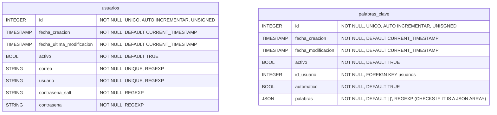
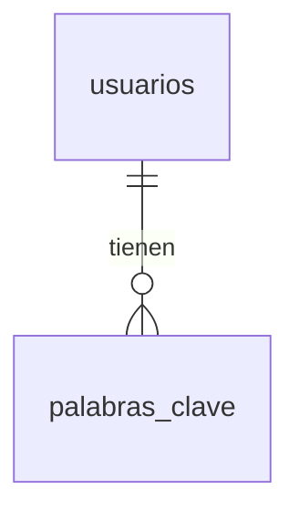

# Base de datos

El proyecto manejara diversos gestores de base de datos para manejar las cuentas de los usuarios, las sesiones de los usuarios, los artículos recolectados.

## SQL (MariaDB)

### Tablas



### Entidad relación



### Triggers

| Nombre                       | Acción          | Tabla            | Descripción                                                  |
| ---------------------------- | --------------- | ---------------- | ------------------------------------------------------------ |
| before_update_usuarios       | `BEFORE UPDATE` | `usuarios`       | Verifica que el usuario se encuentra desactivo antes de realizar la actualización |
| after_insert_usuarios        | `AFTER UPDATE`  | `usuarios`       | Crea una nueva entrada para el usuario en `palabras_clave`   |
| before_update_palabras_clave | `BEFORE UPDATE` | `palabras_clave` | Verifica que el usuario este activado, que no se modifique el id de la entrada, si las palabras clave esta desactivadas no se pueden actualizar |

### Funciones

| Nombre                        | Argumentos              | Retorno            | Descripción                                                  |
| ----------------------------- | ----------------------- | ------------------ | ------------------------------------------------------------ |
| generar_salt                  | `N/A`                   | `VARCHAR(1024)`    | Generar un salt único                                        |
| obtener_id_usuario_por_correo | `correo`                | `INTEGER UNSIGNED` | Retorna el id del usuario recibiendo como argumento el correo |
| login                         | `usuario`, `contrasena` | `INTEGER UNSIGNED` | Retorna el id del usuario teniendo como referencia el usuario y contraseña |
| usuario_disponible            | `usuario`               | `BOOL`             | Retorna verdadero si el usuario esta disponible falso si no. |
| correo_disponible             | `correo`                | `BOOL`             | Retorna verdadero su el correo esta disponible, falso si no. |

### Procedimientos

| Nombre                      | Argumentos                                     | Descripción                                 |
| --------------------------- | ---------------------------------------------- | ------------------------------------------- |
| registrar_usuario           | `usuario`, `correo`, `contraseña`              | Registra usuario en la base de datos        |
| usuarios_cambiar_contrasena | `id_usuario`, `contraseña`, `nueva_contraseña` | Actualiza la contraseña del usuario         |
| usuarios_cambiar_correo     | `id_usuario`, `nuevo_correo`, `contraseña`     | Actualiza el correo del usuario             |
| reset_contrasena            | `id_usuario`, `nueva_contraseña`               | Fuerza el cambio de contraseña del usuario  |
| actualizar_palabras_clave   | `id_usuario`, `nuevas_palabras`, `automático`  | Actualiza las palabras actuales del usuario |

## Redis

| Numero | Nombre            | Descripción                                                  | Duración |
| ------ | ----------------- | ------------------------------------------------------------ | -------- |
| 0      | Sesiones          | Almacena las cookies como llaves y los id de usuarios como valores para el manejo de sesión de la aplicación web. | 30 dias  |
| 1      | Registros         | Almacena los códigos temporales como llaves y la información de registro como valor. | 24 horas |
| 2      | Reseteo pendiente | Utilizado para realizar un cambio de contraseña              | 6 horas  |
| 3      | Confirmar correos | Utilizado para confirmar la nuevas cuentas de correo configuradas | 24 horas |

## MongoDB

La base de datos en la que depende la aplicación es `spainews` la colección `news`

### Colecciones

- `news`

```json
{
	"title": "",
	"description": "",
    "maintext": "",
    "authors": [],
    "category": "",
    "date_publish": "31/12/2022",
    "source_domain": "",
    "url": ""
}
```

