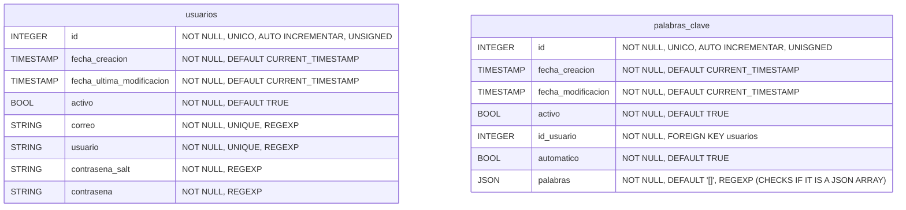
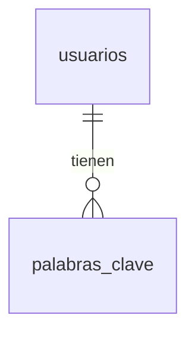

# Base de datos

El proyecto manejara diversos gestores de base de datos para manejar las cuentas de los usuarios, las sesiones de los
usuarios, los artículos recolectados.

## SQL (MariaDB)

### Tablas

### Entidad relación

### Triggers

#### BEFORE UPDATE `usuarios`

- Usuarios desactivados no pueden actualizar atributos diferentes de `activo`.

### Funciones

- `generar_salt() VARCHAR(1024)`: Retorna un salt para ser usado con la función hash.
- `login(usuario, contrasena) id`: Esta función recibe de entrada el usuario y contraseña, retorna el `id` en caso de
  éxito y `-1` en caso de fracaso.
- `usuario_disponible(usuario) BOOL`: Retorna verdadero si el usuario esta disponible para el registro.
- `correo_disponible(usuario) BOOL`: Retorna verdadero si el correo esta disponible para el registro.

### Procedimientos

- `registrar_usuario(usuario, correo, contrasena)`: Confirma que el correo, usuario y contraseña satisfacen las
  expresiones regulares, luego registra al usuario en la base de datos.
- `actualizar_palabras_clave(usuario_o_id, palabras_clave)`: Actualiza el registro de palabras clave para el usuario.
- `usuarios_cambiar_contrasena(id_usuario, contrasena, nueva_contrasena)`: Cambia la contraseña actual del usuario por
  la especificada.

## Redis

| Numero | Nombre            | Descripción                                                  | Duración |
| ------ | ----------------- | ------------------------------------------------------------ | -------- |
| 0      | Sesiones          | Almacena las cookies como llaves y los id de usuarios como valores para el manejo de sesión de la aplicación web. | 30 dias  |
| 1      | Registros         | Almacena los códigos temporales como llaves y la información de registro como valor. | 24 horas |
| 2      | Reseteo pendiente | Utilizado para realizar un cambio de contraseña              | 6 horas  |
| 3      | Confirmar correos | Utilizado para confirmar la nuevas cuentas de correo configuradas | 24 horas |

## MongoDB