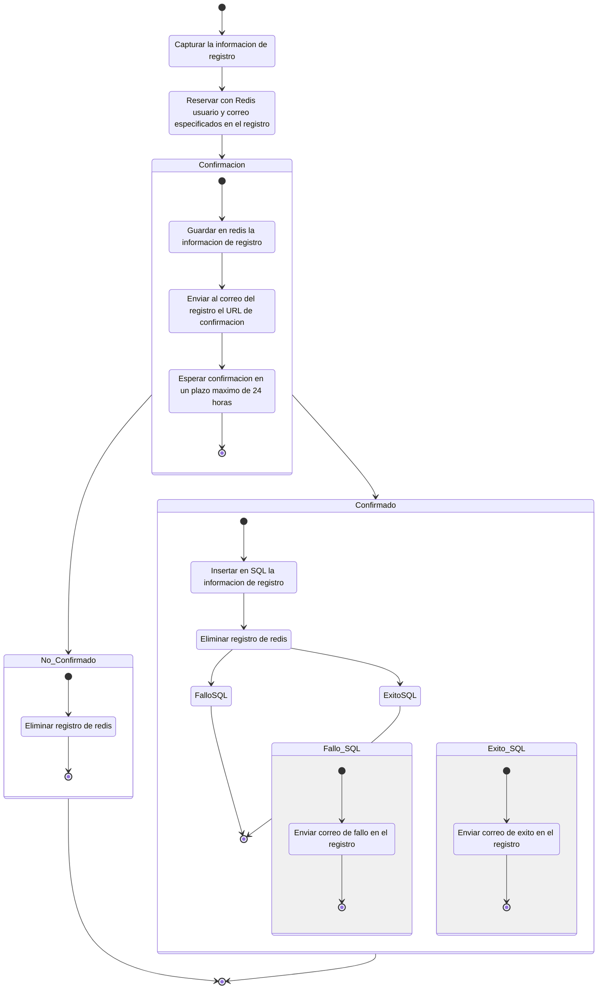

# Procesos del sistema

## Registro

```mermaid
stateDiagram
    capturarDatos : Capturar la informacion de registro
	reservarUsuario : Reservar con Redis usuario y correo especificados en el registro
    state Confirmacion {
    	agregarRedis : Guardar en redis la informacion de registro
    	enviarCorreo : Enviar al correo del registro el URL de confirmacion
    	esperarConfirmacion : Esperar confirmacion en un plazo maximo de 24 horas
    	[*] --> agregarRedis
    	agregarRedis --> enviarCorreo
    	enviarCorreo --> esperarConfirmacion
    	esperarConfirmacion --> [*]
    }
    state No_Confirmado {
    	eliminarRedis : Eliminar registro de redis
    	[*] --> eliminarRedis
    	eliminarRedis --> [*]
    }
    state Confirmado {
    	insertarEnSQL : Insertar en SQL la informacion de registro
    	state Fallo_SQL {
    		enviarCorreoDeFallo : Enviar correo de fallo en el registro
    		[*] --> enviarCorreoDeFallo
    		enviarCorreoDeFallo --> [*]
    	}
    	state Exito_SQL {
    		enviarCorreoDeExito : Enviar correo de exito en el registro
    		[*] --> enviarCorreoDeExito
    		enviarCorreoDeExito --> [*]
    	}
    	eliminarRedis2 : Eliminar registro de redis
    	[*] --> insertarEnSQL
    	insertarEnSQL --> eliminarRedis2
    	eliminarRedis2 --> FalloSQL
    	eliminarRedis2 --> ExitoSQL
    	FalloSQL --> [*]
    	ExitoSQL --> [*]
    }
    [*] --> capturarDatos
    capturarDatos --> reservarUsuario
    reservarUsuario --> Confirmacion
    Confirmacion --> No_Confirmado
    Confirmacion --> Confirmado
    No_Confirmado --> [*]
    Confirmado --> [*]
    
```

